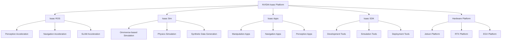
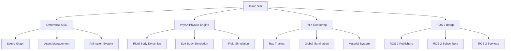

# Chapter 7: NVIDIA Isaac - The AI-robot Brain

## Overview

NVIDIA Isaac represents a comprehensive platform for developing AI-powered robotics applications, combining hardware acceleration, software frameworks, and development tools into an integrated solution. This chapter explores the NVIDIA Isaac ecosystem, including Isaac ROS, Isaac Sim, and the underlying technologies that enable sophisticated AI capabilities in robotics systems. We'll examine how Isaac transforms traditional robotics by providing GPU-accelerated perception, navigation, and manipulation capabilities.

## Learning Objectives

By the end of this chapter, readers will be able to:
- Understand the NVIDIA Isaac platform architecture and components
- Implement GPU-accelerated perception pipelines using Isaac ROS
- Utilize Isaac Sim for advanced robotics simulation and training
- Deploy AI models for robotics applications using Isaac frameworks
- Integrate Isaac capabilities with ROS 2 for hybrid robotic systems
- Evaluate performance benefits of GPU acceleration in robotics

## 7.1 Introduction to NVIDIA Isaac Platform

### 7.1.1 Architecture Overview

The NVIDIA Isaac platform comprises several interconnected components that work together to provide a complete AI-robotics solution:

- **Isaac ROS**: GPU-accelerated ROS 2 packages for perception and navigation
- **Isaac Sim**: Advanced simulation environment built on Omniverse
- **Isaac Apps**: Pre-built applications for common robotics tasks
- **Isaac SDK**: Development tools and libraries for custom robotics applications
- **Hardware Platform**: NVIDIA Jetson and RTX platforms optimized for robotics

### 7.1.2 GPU Acceleration Benefits

GPU acceleration provides significant advantages for robotics applications:

- **Parallel Processing**: Handle multiple sensor streams simultaneously
- **Real-time Performance**: Process high-resolution data at frame rates required for robotics
- **AI Model Execution**: Run complex neural networks for perception and decision-making
- **Sensor Fusion**: Combine data from multiple sensors efficiently

### 7.1.3 Isaac Ecosystem Components



## 7.2 Isaac ROS - GPU-Accelerated ROS 2 Packages

### 7.2.1 Overview of Isaac ROS

Isaac ROS bridges the gap between traditional ROS 2 and GPU acceleration, providing hardware-accelerated implementations of common robotics algorithms. Key features include:

- **Hardware Acceleration**: Leverage NVIDIA GPUs for performance-critical operations
- **ROS 2 Compatibility**: Full integration with ROS 2 ecosystem
- **Optimized Algorithms**: GPU-optimized implementations of perception, navigation, and SLAM algorithms
- **Modular Design**: Independent packages that can be integrated as needed

### 7.2.2 Installation and Setup

```bash
# Install Isaac ROS dependencies
sudo apt update
sudo apt install nvidia-jetpack

# Install Isaac ROS packages
sudo apt install ros-humble-isaac-ros-common
sudo apt install ros-humble-isaac-ros-perception
sudo apt install ros-humble-isaac-ros-navigation
sudo apt install ros-humble-isaac-ros-slam

# Verify installation
ros2 run isaac_ros_common isaac_ros_version
```

### 7.2.3 Isaac ROS Perception Pipeline

The Isaac ROS perception pipeline accelerates computer vision tasks:

```cpp
// Example Isaac ROS perception node
#include "rclcpp/rclcpp.hpp"
#include "sensor_msgs/msg/image.hpp"
#include "isaac_ros_apriltag_interfaces/msg/april_tag_detection_array.hpp"
#include "isaac_ros_visual_slam/visual_slam_node.hpp"

class IsaacPerceptionNode : public rclcpp::Node
{
public:
    IsaacPerceptionNode() : Node("isaac_perception_node")
    {
        // Subscribe to camera image
        image_sub_ = this->create_subscription<sensor_msgs::msg::Image>(
            "camera/image_raw", 10,
            std::bind(&IsaacPerceptionNode::image_callback, this, std::placeholders::_1));

        // Publish AprilTag detections
        tag_pub_ = this->create_publisher<isaac_ros_apriltag_interfaces::msg::AprilTagDetectionArray>(
            "apriltag_detections", 10);

        // Initialize Isaac AprilTag detector
        apriltag_node_ = std::make_shared<isaac_ros_apriltag::AprilTagNode>(this);
    }

private:
    void image_callback(const sensor_msgs::msg::Image::SharedPtr msg)
    {
        // Process image using Isaac's GPU-accelerated AprilTag detection
        // This would typically involve GPU-accelerated preprocessing
        RCLCPP_INFO(this->get_logger(), "Processing image for AprilTag detection");
    }

    rclcpp::Subscription<sensor_msgs::msg::Image>::SharedPtr image_sub_;
    rclcpp::Publisher<isaac_ros_apriltag_interfaces::msg::AprilTagDetectionArray>::SharedPtr tag_pub_;
    std::shared_ptr<isaac_ros_apriltag::AprilTagNode> apriltag_node_;
};
```

### 7.2.4 GPU-Accelerated SLAM with Isaac

Isaac provides GPU-accelerated Visual SLAM capabilities:

```cpp
// Example Isaac Visual SLAM node
#include "rclcpp/rclcpp.hpp"
#include "sensor_msgs/msg/image.hpp"
#include "sensor_msgs/msg/camera_info.hpp"
#include "nav_msgs/msg/odometry.hpp"
#include "geometry_msgs/msg/pose_stamped.hpp"

class IsaacSLAMNode : public rclcpp::Node
{
public:
    IsaacSLAMNode() : Node("isaac_slam_node")
    {
        // Subscribe to stereo camera images
        left_image_sub_ = this->create_subscription<sensor_msgs::msg::Image>(
            "camera/left/image_raw", 10,
            std::bind(&IsaacSLAMNode::left_image_callback, this, std::placeholders::_1));

        right_image_sub_ = this->create_subscription<sensor_msgs::msg::Image>(
            "camera/right/image_raw", 10,
            std::bind(&IsaacSLAMNode::right_image_callback, this, std::placeholders::_1));

        // Publish odometry and pose
        odom_pub_ = this->create_publisher<nav_msgs::msg::Odometry>("visual_odom", 10);
        pose_pub_ = this->create_publisher<geometry_msgs::msg::PoseStamped>("visual_pose", 10);

        // Initialize Isaac Visual SLAM
        initialize_visual_slam();
    }

private:
    void left_image_callback(const sensor_msgs::msg::Image::SharedPtr msg)
    {
        // Process left camera image using GPU-accelerated stereo matching
        if (right_image_available_) {
            perform_gpu_stereo_matching(msg, right_image_);
        }
    }

    void right_image_callback(const sensor_msgs::msg::Image::SharedPtr msg)
    {
        right_image_ = msg;
        right_image_available_ = true;
    }

    void initialize_visual_slam()
    {
        // Configure GPU-accelerated feature detection and matching
        // Set up CUDA streams for parallel processing
    }

    void perform_gpu_stereo_matching(
        const sensor_msgs::msg::Image::SharedPtr left_img,
        const sensor_msgs::msg::Image::SharedPtr right_img)
    {
        // GPU-accelerated stereo matching implementation
        // This would use Isaac's optimized stereo algorithms
    }

    rclcpp::Subscription<sensor_msgs::msg::Image>::SharedPtr left_image_sub_;
    rclcpp::Subscription<sensor_msgs::msg::Image>::SharedPtr right_image_sub_;
    rclcpp::Publisher<nav_msgs::msg::Odometry>::SharedPtr odom_pub_;
    rclcpp::Publisher<geometry_msgs::msg::PoseStamped>::SharedPtr pose_pub_;

    sensor_msgs::msg::Image::SharedPtr right_image_;
    bool right_image_available_ = false;
};
```

### 7.2.5 Isaac ROS Navigation Stack

Isaac enhances traditional navigation with GPU acceleration:

```cpp
// Example Isaac navigation node
#include "rclcpp/rclcpp.hpp"
#include "geometry_msgs/msg/twist.hpp"
#include "nav_msgs/msg/occupancy_grid.hpp"
#include "sensor_msgs/msg/laser_scan.hpp"
#include "isaac_ros_nitros/types/nitros_format_agent.hpp"

class IsaacNavigationNode : public rclcpp::Node
{
public:
    IsaacNavigationNode() : Node("isaac_navigation_node")
    {
        // Subscribe to sensor data
        laser_sub_ = this->create_subscription<sensor_msgs::msg::LaserScan>(
            "scan", 10,
            std::bind(&IsaacNavigationNode::laser_callback, this, std::placeholders::_1));

        // Publish velocity commands
        cmd_vel_pub_ = this->create_publisher<geometry_msgs::msg::Twist>("cmd_vel", 10);

        // Initialize GPU-accelerated path planning
        initialize_gpu_path_planner();
    }

private:
    void laser_callback(const sensor_msgs::msg::LaserScan::SharedPtr msg)
    {
        // Process laser scan using GPU-accelerated obstacle detection
        // Generate path using GPU-accelerated A* or Dijkstra's algorithm
        auto cmd_vel = geometry_msgs::msg::Twist();

        // GPU-accelerated obstacle avoidance
        if (detect_obstacles_gpu(msg)) {
            cmd_vel.linear.x = 0.0;
            cmd_vel.angular.z = 0.5; // Turn to avoid obstacle
        } else {
            cmd_vel.linear.x = 0.5; // Move forward
            cmd_vel.angular.z = 0.0;
        }

        cmd_vel_pub_->publish(cmd_vel);
    }

    bool detect_obstacles_gpu(const sensor_msgs::msg::LaserScan::SharedPtr scan)
    {
        // GPU-accelerated obstacle detection implementation
        // Uses CUDA kernels for parallel processing of laser data
        return false; // Placeholder implementation
    }

    void initialize_gpu_path_planner()
    {
        // Initialize GPU-accelerated path planning algorithms
        // Set up CUDA contexts and memory pools
    }

    rclcpp::Subscription<sensor_msgs::msg::LaserScan>::SharedPtr laser_sub_;
    rclcpp::Publisher<geometry_msgs::msg::Twist>::SharedPtr cmd_vel_pub_;
};
```

## 7.3 Isaac Sim - Advanced Simulation Environment

### 7.3.1 Introduction to Isaac Sim

Isaac Sim is NVIDIA's advanced robotics simulation environment built on the Omniverse platform. Key features include:

- **Physically Accurate Simulation**: Realistic physics and material properties
- **High-Fidelity Graphics**: Photorealistic rendering for computer vision training
- **Synthetic Data Generation**: Large-scale dataset creation for AI training
- **Multi-Robot Simulation**: Support for complex multi-robot scenarios
- **ROS 2 Integration**: Seamless integration with ROS 2 workflows

### 7.3.2 Isaac Sim Architecture



### 7.3.3 Setting up Isaac Sim

```python
# Python example of Isaac Sim setup
import omni
from pxr import Usd, UsdGeom, Gf, Sdf
import carb
import numpy as np

class IsaacSimEnvironment:
    def __init__(self):
        self.world = None
        self.robots = []
        self.sensors = []

    def setup_scene(self):
        # Create a new USD stage
        stage = omni.usd.get_context().get_stage()

        # Create ground plane
        self.create_ground_plane(stage)

        # Setup lighting
        self.setup_lighting(stage)

        # Configure physics
        self.configure_physics()

        # Setup ROS 2 bridge
        self.setup_ros_bridge()

    def create_ground_plane(self, stage):
        # Create ground plane with realistic properties
        ground_path = Sdf.Path("/World/ground_plane")
        ground_plane = UsdGeom.Mesh.Define(stage, ground_path)

        # Set up ground plane geometry
        vertices = [
            Gf.Vec3f(-10, -10, 0), Gf.Vec3f(10, -10, 0),
            Gf.Vec3f(10, 10, 0), Gf.Vec3f(-10, 10, 0)
        ]
        faces = [0, 1, 2, 0, 2, 3]

        ground_plane.CreatePointsAttr(vertices)
        ground_plane.CreateFaceVertexIndicesAttr(faces)
        ground_plane.CreateFaceVertexCountsAttr([3, 3])

    def setup_lighting(self, stage):
        # Create dome light for realistic illumination
        dome_light_path = Sdf.Path("/World/domeLight")
        dome_light = UsdGeom.DomeLight.Define(stage, dome_light_path)
        dome_light.CreateIntensityAttr(1000)

        # Add directional light
        directional_light_path = Sdf.Path("/World/directionalLight")
        directional_light = UsdGeom.DistantLight.Define(stage, directional_light_path)
        directional_light.CreateIntensityAttr(300)
        directional_light.CreateAngleAttr(0.5)

    def configure_physics(self):
        # Configure PhysX physics properties
        carb.settings.get_settings().set("/physics/enable", True)
        carb.settings.get_settings().set("/physics/groundEnabled", True)
        carb.settings.get_settings().set("/physics/groundPosition", [0, 0, 0])

    def setup_ros_bridge(self):
        # Initialize ROS 2 bridge for Isaac Sim
        try:
            import omni.isaac.ros2_bridge
            print("ROS 2 bridge initialized successfully")
        except ImportError:
            print("ROS 2 bridge not available")

# Usage example
sim_env = IsaacSimEnvironment()
sim_env.setup_scene()
```

### 7.3.4 Robot Integration in Isaac Sim

```python
# Example of robot integration in Isaac Sim
import omni
from omni.isaac.core import World
from omni.isaac.core.robots import Robot
from omni.isaac.core.utils.stage import add_reference_to_stage
from omni.isaac.core.utils.nucleus import get_assets_root_path
from omni.isaac.core.utils.prims import get_prim_at_path
import numpy as np

class IsaacSimRobot:
    def __init__(self, robot_name, usd_path):
        self.robot_name = robot_name
        self.usd_path = usd_path
        self.robot = None
        self.world = World(stage_units_in_meters=1.0)

    def load_robot(self):
        # Add robot to the stage
        add_reference_to_stage(
            usd_path=self.usd_path,
            prim_path=f"/World/{self.robot_name}"
        )

        # Create robot object
        self.robot = self.world.scene.add(
            Robot(
                prim_path=f"/World/{self.robot_name}",
                name=self.robot_name,
                usd_path=self.usd_path
            )
        )

    def setup_sensors(self):
        # Add various sensors to the robot
        self.add_camera_sensor()
        self.add_lidar_sensor()
        self.add_imu_sensor()

    def add_camera_sensor(self):
        # Add RGB camera to the robot
        from omni.isaac.sensor import Camera

        camera = Camera(
            prim_path=f"/World/{self.robot_name}/camera",
            position=np.array([0.2, 0, 0.1]),
            orientation=np.array([0, 0, 0, 1])
        )
        camera.initialize()
        return camera

    def add_lidar_sensor(self):
        # Add LIDAR sensor to the robot
        from omni.isaac.range_sensor import RotatingLidarPhysX

        lidar = RotatingLidarPhysX(
            prim_path=f"/World/{self.robot_name}/lidar",
            position=np.array([0, 0, 0.5]),
            configuration=self.get_lidar_config()
        )
        lidar.initialize()
        return lidar

    def get_lidar_config(self):
        # Configure LIDAR parameters
        return {
            "rotation_rate": 10,  # Hz
            "number_of_channels": 16,
            "points_per_channel": 1800,
            "horizontal_resolution": 2,
            "vertical_resolution": 2,
            "range": 25.0
        }

    def setup_ros_interfaces(self):
        # Set up ROS 2 interfaces for the robot
        from omni.isaac.ros2_bridge import ROS2Bridge

        # Create ROS 2 publishers and subscribers
        self.ros2_bridge = ROS2Bridge()

        # Example: Subscribe to velocity commands
        self.ros2_bridge.create_subscription(
            "geometry_msgs/msg/Twist",
            f"/{self.robot_name}/cmd_vel",
            self.velocity_command_callback
        )

        # Example: Publish sensor data
        self.ros2_bridge.create_publisher(
            "sensor_msgs/msg/LaserScan",
            f"/{self.robot_name}/scan"
        )

    def velocity_command_callback(self, msg):
        # Process velocity commands from ROS 2
        linear_vel = msg.linear.x
        angular_vel = msg.angular.z

        # Apply commands to robot
        self.apply_velocity_commands(linear_vel, angular_vel)

    def apply_velocity_commands(self, linear_vel, angular_vel):
        # Apply velocity commands to robot joints
        # This would typically involve inverse kinematics or direct joint control
        pass

# Usage example
robot_sim = IsaacSimRobot("my_robot", "/path/to/robot.usd")
robot_sim.load_robot()
robot_sim.setup_sensors()
robot_sim.setup_ros_interfaces()
```

### 7.3.5 Synthetic Data Generation

Isaac Sim excels at generating synthetic training data for AI models:

```python
# Example of synthetic data generation pipeline
import omni
from omni.isaac.core import World
from omni.isaac.synthetic_utils import SyntheticDataHelper
import numpy as np
import cv2
import json

class SyntheticDataGenerator:
    def __init__(self, scene_config):
        self.world = World(stage_units_in_meters=1.0)
        self.scene_config = scene_config
        self.data_helper = SyntheticDataHelper()
        self.dataset_path = scene_config.get("dataset_path", "./synthetic_dataset")

    def generate_segmentation_dataset(self, num_samples=1000):
        """
        Generate semantic segmentation dataset with realistic variations
        """
        for i in range(num_samples):
            # Randomize scene parameters
            self.randomize_scene()

            # Capture RGB and segmentation data
            rgb_image = self.capture_rgb_image()
            seg_image = self.capture_segmentation_image()

            # Save data with annotations
            self.save_sample(f"sample_{i:06d}", rgb_image, seg_image)

            # Move to next sample position
            self.move_camera()

    def randomize_scene(self):
        """
        Randomize scene parameters for domain randomization
        """
        # Randomize lighting
        self.randomize_lighting()

        # Randomize object positions
        self.randomize_object_positions()

        # Randomize textures and materials
        self.randomize_materials()

        # Randomize camera parameters
        self.randomize_camera_params()

    def randomize_lighting(self):
        """
        Randomize lighting conditions
        """
        import random

        # Randomize dome light intensity
        dome_light = get_prim_at_path("/World/domeLight")
        intensity = random.uniform(500, 1500)
        dome_light.GetAttribute("inputs:intensity").Set(intensity)

        # Randomize directional light angle
        directional_light = get_prim_at_path("/World/directionalLight")
        angle = random.uniform(0, 360)
        directional_light.GetAttribute("inputs:angle").Set(angle)

    def capture_rgb_image(self):
        """
        Capture RGB image from current camera view
        """
        # Implementation to capture RGB image
        pass

    def capture_segmentation_image(self):
        """
        Capture semantic segmentation image
        """
        # Implementation to capture segmentation data
        pass

    def save_sample(self, sample_name, rgb_image, seg_image):
        """
        Save sample data with annotations
        """
        import os

        sample_dir = os.path.join(self.dataset_path, sample_name)
        os.makedirs(sample_dir, exist_ok=True)

        # Save RGB image
        rgb_path = os.path.join(sample_dir, "rgb.png")
        cv2.imwrite(rgb_path, rgb_image)

        # Save segmentation image
        seg_path = os.path.join(sample_dir, "segmentation.png")
        cv2.imwrite(seg_path, seg_image)

        # Save annotations
        annotations = {
            "sample_name": sample_name,
            "rgb_path": rgb_path,
            "seg_path": seg_path,
            "scene_parameters": self.get_current_scene_params()
        }

        annotation_path = os.path.join(sample_dir, "annotations.json")
        with open(annotation_path, 'w') as f:
            json.dump(annotations, f, indent=2)

    def get_current_scene_params(self):
        """
        Get current scene parameters for reproducibility
        """
        return {
            "lighting": self.get_lighting_params(),
            "objects": self.get_object_params(),
            "camera": self.get_camera_params()
        }

# Usage example
config = {
    "dataset_path": "./robotics_segmentation_dataset",
    "scene_objects": ["cube", "sphere", "cylinder"],
    "camera_positions": [(0, 0, 2), (1, 1, 2), (-1, 1, 2)]
}

generator = SyntheticDataGenerator(config)
generator.generate_segmentation_dataset(num_samples=5000)
```

## 7.4 Isaac Apps - Pre-built Applications

### 7.4.1 Overview of Isaac Apps

Isaac Apps provide pre-built, optimized applications for common robotics tasks:

- **Isaac Manipulator**: Advanced manipulation and grasping
- **Isaac Navigation**: Autonomous navigation and path planning
- **Isaac Perception**: Object detection and scene understanding
- **Isaac Foundation**: Base applications for custom development

### 7.4.2 Isaac Manipulator App

The Isaac Manipulator app provides advanced manipulation capabilities:

```python
# Example Isaac Manipulator application
import omni
from omni.isaac.core import World
from omni.isaac.core.objects import DynamicCuboid
from omni.isaac.core.utils.stage import add_reference_to_stage
from omni.isaac.franka import Franka
from omvi.isaac.core.utils.types import ArticulationAction
import numpy as np

class IsaacManipulatorApp:
    def __init__(self):
        self.world = World(stage_units_in_meters=1.0)
        self.robot = None
        self.target_object = None

    def setup_manipulation_scene(self):
        # Load robot
        self.robot = self.world.scene.add(
            Franka(prim_path="/World/Franka", name="franka")
        )

        # Add target object
        self.target_object = self.world.scene.add(
            DynamicCuboid(
                prim_path="/World/target_object",
                name="target_object",
                position=np.array([0.5, 0, 0.1]),
                size=0.05,
                color=np.array([1, 0, 0])
            )
        )

        # Add goal position
        self.goal_position = np.array([0.3, 0.3, 0.1])

    def execute_grasp_task(self):
        """
        Execute grasping task using Isaac's manipulation pipeline
        """
        # Move to pre-grasp position
        self.move_to_position(self.get_pre_grasp_position())

        # Lower to grasp position
        self.move_to_position(self.get_grasp_position())

        # Close gripper
        self.close_gripper()

        # Lift object
        self.lift_object()

        # Move to goal position
        self.move_to_position(self.goal_position)

        # Release object
        self.open_gripper()

    def get_pre_grasp_position(self):
        """
        Calculate pre-grasp position based on target object
        """
        target_pos = self.target_object.get_world_pose()[0]
        pre_grasp_pos = target_pos.copy()
        pre_grasp_pos[2] += 0.1  # 10cm above target
        return pre_grasp_pos

    def get_grasp_position(self):
        """
        Calculate grasp position
        """
        target_pos = self.target_object.get_world_pose()[0]
        return target_pos

    def move_to_position(self, position):
        """
        Move end-effector to specified position
        """
        # Implementation of position-based motion control
        # Would use Isaac's inverse kinematics solvers
        pass

    def close_gripper(self):
        """
        Close robot gripper
        """
        # Send gripper close command
        pass

    def open_gripper(self):
        """
        Open robot gripper
        """
        # Send gripper open command
        pass

    def lift_object(self):
        """
        Lift grasped object
        """
        current_pos = self.get_end_effector_position()
        lift_pos = current_pos.copy()
        lift_pos[2] += 0.1  # Lift 10cm
        self.move_to_position(lift_pos)

# Usage example
manipulator_app = IsaacManipulatorApp()
manipulator_app.setup_manipulation_scene()
manipulator_app.execute_grasp_task()
```

### 7.4.3 Isaac Navigation App

The Isaac Navigation app provides autonomous navigation capabilities:

```python
# Example Isaac Navigation application
import omni
from omni.isaac.core import World
from omni.isaac.core.robots import Robot
from omni.isaac.core.utils.stage import add_reference_to_stage
from omni.isaac.core.utils.nucleus import get_assets_root_path
from omni.isaac.navigation import NavigationGraph
import numpy as np

class IsaacNavigationApp:
    def __init__(self):
        self.world = World(stage_units_in_meters=1.0)
        self.robot = None
        self.nav_graph = None
        self.path_planner = None

    def setup_navigation_scene(self):
        # Load robot
        self.robot = self.world.scene.add(
            Robot(
                prim_path="/World/Robot",
                name="navigation_robot",
                usd_path=get_assets_root_path() + "/Isaac/Robots/Turtlebot3/nav_sensors.usd"
            )
        )

        # Build navigation graph
        self.nav_graph = NavigationGraph(
            prim_path="/World/NavigationGraph",
            name="nav_graph"
        )

        # Initialize path planner
        self.path_planner = self.initialize_path_planner()

    def initialize_path_planner(self):
        """
        Initialize GPU-accelerated path planning
        """
        # Set up GPU-accelerated path planning algorithms
        # Would integrate with Isaac's navigation stack
        pass

    def navigate_to_goal(self, goal_position):
        """
        Navigate robot to specified goal position
        """
        # Plan path using GPU-accelerated algorithms
        path = self.plan_path_to_goal(goal_position)

        # Execute navigation with obstacle avoidance
        self.follow_path(path)

        # Monitor progress and handle dynamic obstacles
        self.monitor_navigation()

    def plan_path_to_goal(self, goal_position):
        """
        Plan path to goal using GPU-accelerated algorithms
        """
        # Implementation of GPU-accelerated path planning
        # Would use Isaac's optimized algorithms
        start_position = self.robot.get_world_pose()[0]
        path = [start_position, goal_position]  # Placeholder
        return path

    def follow_path(self, path):
        """
        Follow planned path with obstacle avoidance
        """
        for waypoint in path:
            self.move_to_waypoint(waypoint)

            # Check for obstacles and replan if necessary
            if self.detect_obstacles():
                self.replan_path()

    def detect_obstacles(self):
        """
        Detect obstacles using sensor data
        """
        # Process LIDAR/camera data for obstacle detection
        # GPU-accelerated processing
        return False  # Placeholder

    def replan_path(self):
        """
        Replan path due to detected obstacles
        """
        # GPU-accelerated replanning
        pass

    def move_to_waypoint(self, waypoint):
        """
        Move robot to specified waypoint
        """
        # Implementation of motion control to reach waypoint
        pass

    def monitor_navigation(self):
        """
        Monitor navigation progress and handle exceptions
        """
        # Monitor navigation status
        # Handle navigation failures or timeouts
        pass

# Usage example
nav_app = IsaacNavigationApp()
nav_app.setup_navigation_scene()
nav_app.navigate_to_goal(np.array([5.0, 5.0, 0.0]))
```

## 7.5 Isaac SDK and Development Tools

### 7.5.1 Isaac SDK Overview

The Isaac SDK provides development tools and libraries for building custom robotics applications:

- **Isaac Gym**: GPU-accelerated reinforcement learning environment
- **Isaac Sim Bridge**: Tools for connecting simulation to real hardware
- **Isaac Message Bridge**: Communication between different systems
- **Isaac Apps Framework**: Tools for building custom applications

### 7.5.2 Isaac Gym for Reinforcement Learning

Isaac Gym provides GPU-accelerated environments for reinforcement learning:

```python
# Example Isaac Gym environment for humanoid robot control
import torch
import numpy as np
from isaacgym import gymapi, gymtorch
from isaacgym.torch_utils import *

class IsaacGymHumanoidEnv:
    def __init__(self, cfg):
        self.cfg = cfg
        self.device = cfg['device']

        # Initialize gym
        self.gym = gymapi.acquire_gym()
        self.sim = None
        self.envs = []

        # Initialize environments
        self.initialize_sim()
        self.create_envs()

    def initialize_sim(self):
        """
        Initialize Isaac Gym simulation
        """
        # Set up simulation parameters
        sim_params = gymapi.SimParams()
        sim_params.up_axis = gymapi.UP_AXIS_Z
        sim_params.gravity = gymapi.Vec3(0.0, 0.0, -9.81)

        # Set up physics parameters
        sim_params.physx.solver_type = 1
        sim_params.physx.num_position_iterations = 8
        sim_params.physx.num_velocity_iterations = 1
        sim_params.physx.max_gpu_contact_pairs = 2**23
        sim_params.physx.num_threads = 4
        sim_params.physx.rest_offset = 0.0
        sim_params.physx.contact_offset = 0.001

        # Create simulation
        self.sim = self.gym.create_sim(0, 0, gymapi.SIM_PHYSX, sim_params)

        # Create viewer
        self.viewer = self.gym.create_viewer(self.sim, gymapi.CameraProperties())

    def create_envs(self):
        """
        Create multiple environments for parallel training
        """
        # Load humanoid asset
        asset_root = "path/to/humanoid/asset"
        asset_file = "humanoid.urdf"

        asset_options = gymapi.AssetOptions()
        asset_options.fix_base_link = False
        asset_options.default_dof_drive_mode = gymapi.DOF_MODE_NONE
        asset_options.heightfield_texture_resolution = 0
        asset_options.armature = 0.01
        asset_options.thickness = 0.02

        humanoid_asset = self.gym.load_asset(self.sim, asset_root, asset_file, asset_options)

        # Create environments
        spacing = self.cfg['env']['spacing']
        num_per_row = int(np.sqrt(self.cfg['env']['num_envs']))

        for i in range(self.cfg['env']['num_envs']):
            # Create environment
            env = self.gym.create_env(self.sim,
                                    gymapi.Vec3(-spacing, -spacing, -spacing),
                                    gymapi.Vec3(spacing, spacing, spacing),
                                    num_per_row)

            # Add humanoid to environment
            pose = gymapi.Transform()
            pose.p = gymapi.Vec3(0.0, 0.0, 1.0)
            pose.r = gymapi.Quat(0.0, 0.0, 0.0, 1.0)

            humanoid_actor = self.gym.create_actor(env, humanoid_asset, pose, "humanoid", i, 0)

            # Configure DOF properties
            dof_props = self.gym.get_actor_dof_properties(env, humanoid_actor)
            dof_props['driveMode'].fill(gymapi.DOF_MODE_EFFORT)
            dof_props['stiffness'] = 0.0
            dof_props['damping'] = 0.5
            self.gym.set_actor_dof_properties(env, humanoid_actor, dof_props)

            self.envs.append(env)

    def compute_observations(self):
        """
        Compute observations for all environments
        """
        # Get actor root state tensor
        actor_root_state = self.gym.acquire_actor_root_state_tensor(self.sim)
        self.root_states = gymtorch.wrap_tensor(actor_root_state)

        # Get dof state tensor
        dof_state = self.gym.acquire_dof_state_tensor(self.sim)
        self.dof_states = gymtorch.wrap_tensor(dof_state)

        # Compute observations based on current states
        obs = self.compute_humanoid_observations()
        return obs

    def compute_humanoid_observations(self):
        """
        Compute humanoid-specific observations
        """
        # Extract relevant state information
        root_pos = self.root_states[:, 0:3]
        root_rot = self.root_states[:, 3:7]
        root_vel = self.root_states[:, 7:10]
        root_ang_vel = self.root_states[:, 10:13]

        # Extract DOF positions and velocities
        dof_pos = self.dof_states[:, 0::2]
        dof_vel = self.dof_states[:, 1::2]

        # Compute observations
        obs = torch.cat([
            root_pos[:, 2:3],  # height
            quat_rotate_inverse(root_rot, root_vel),  # linear velocity
            quat_rotate_inverse(root_rot, root_ang_vel),  # angular velocity
            dof_pos,  # joint positions
            dof_vel,  # joint velocities
        ], dim=-1)

        return obs

    def compute_rewards(self, actions):
        """
        Compute rewards for all environments
        """
        # Compute humanoid-specific rewards
        # This would include rewards for forward motion, balance, etc.
        pass

    def reset_idx(self, env_ids):
        """
        Reset specified environments
        """
        # Reset humanoid positions and velocities
        pass

# Usage example
config = {
    'device': 'cuda',
    'env': {
        'num_envs': 4096,
        'spacing': 2.5
    }
}

env = IsaacGymHumanoidEnv(config)
```

## 7.6 Integration with ROS 2

### 7.6.1 ROS 2 Bridge for Isaac Sim

Integrating Isaac Sim with ROS 2 enables hybrid simulation-real robot workflows:

```cpp
// Example ROS 2 bridge node for Isaac Sim
#include "rclcpp/rclcpp.hpp"
#include "geometry_msgs/msg/twist.hpp"
#include "sensor_msgs/msg/laser_scan.hpp"
#include "nav_msgs/msg/odometry.hpp"
#include "std_msgs/msg/float64_multi_array.hpp"

class IsaacSimROS2Bridge : public rclcpp::Node
{
public:
    IsaacSimROS2Bridge() : Node("isaac_sim_ros2_bridge")
    {
        // Subscribe to ROS 2 topics for robot control
        cmd_vel_sub_ = this->create_subscription<geometry_msgs::msg::Twist>(
            "/cmd_vel", 10,
            std::bind(&IsaacSimROS2Bridge::cmd_vel_callback, this, std::placeholders::_1));

        joint_cmd_sub_ = this->create_subscription<std_msgs::msg::Float64MultiArray>(
            "/joint_commands", 10,
            std::bind(&IsaacSimROS2Bridge::joint_cmd_callback, this, std::placeholders::_1));

        // Publish sensor data from Isaac Sim
        laser_pub_ = this->create_publisher<sensor_msgs::msg::LaserScan>("/scan", 10);
        odom_pub_ = this->create_publisher<nav_msgs::msg::Odometry>("/odom", 10);
        imu_pub_ = this->create_publisher<sensor_msgs::msg::Imu>("/imu/data", 10);

        // Timer for publishing sensor data
        timer_ = this->create_wall_timer(
            std::chrono::milliseconds(50),  // 20 Hz
            std::bind(&IsaacSimROS2Bridge::publish_sensor_data, this));
    }

private:
    void cmd_vel_callback(const geometry_msgs::msg::Twist::SharedPtr msg)
    {
        // Forward velocity commands to Isaac Sim
        RCLCPP_INFO(this->get_logger(),
            "Received cmd_vel: linear.x=%f, angular.z=%f",
            msg->linear.x, msg->angular.z);

        // Send to Isaac Sim through appropriate interface
        send_velocity_commands_to_sim(msg);
    }

    void joint_cmd_callback(const std_msgs::msg::Float64MultiArray::SharedPtr msg)
    {
        // Forward joint commands to Isaac Sim
        RCLCPP_INFO(this->get_logger(),
            "Received %zu joint commands", msg->data.size());

        // Send to Isaac Sim
        send_joint_commands_to_sim(msg);
    }

    void publish_sensor_data()
    {
        // Publish sensor data from Isaac Sim
        publish_laser_scan();
        publish_odometry();
        publish_imu_data();
    }

    void send_velocity_commands_to_sim(const geometry_msgs::msg::Twist::SharedPtr cmd)
    {
        // Implementation to send velocity commands to Isaac Sim
        // This would typically use Isaac Sim's Python API or direct integration
    }

    void send_joint_commands_to_sim(const std_msgs::msg::Float64MultiArray::SharedPtr cmd)
    {
        // Implementation to send joint commands to Isaac Sim
    }

    void publish_laser_scan()
    {
        // Get laser scan data from Isaac Sim and publish as ROS 2 message
        auto scan_msg = sensor_msgs::msg::LaserScan();
        // ... populate scan message with data from Isaac Sim
        laser_pub_->publish(scan_msg);
    }

    void publish_odometry()
    {
        // Get odometry data from Isaac Sim and publish as ROS 2 message
        auto odom_msg = nav_msgs::msg::Odometry();
        // ... populate odometry message with data from Isaac Sim
        odom_pub_->publish(odom_msg);
    }

    void publish_imu_data()
    {
        // Get IMU data from Isaac Sim and publish as ROS 2 message
        auto imu_msg = sensor_msgs::msg::Imu();
        // ... populate IMU message with data from Isaac Sim
        imu_pub_->publish(imu_msg);
    }

    rclcpp::Subscription<geometry_msgs::msg::Twist>::SharedPtr cmd_vel_sub_;
    rclcpp::Subscription<std_msgs::msg::Float64MultiArray>::SharedPtr joint_cmd_sub_;
    rclcpp::Publisher<sensor_msgs::msg::LaserScan>::SharedPtr laser_pub_;
    rclcpp::Publisher<nav_msgs::msg::Odometry>::SharedPtr odom_pub_;
    rclcpp::Publisher<sensor_msgs::msg::Imu>::SharedPtr imu_pub_;
    rclcpp::TimerBase::SharedPtr timer_;
};
```

### 7.6.2 Isaac ROS 2 Hardware Interface

Creating a hardware interface to connect Isaac capabilities with real robots:

```cpp
// Example hardware interface for Isaac-ROS integration
#include "hardware_interface/handle.hpp"
#include "hardware_interface/hardware_info.hpp"
#include "hardware_interface/system_interface.hpp"
#include "hardware_interface/types/hardware_interface_return_values.hpp"
#include "rclcpp/rclcpp.hpp"
#include "std_msgs/msg/float64_multi_array.hpp"
#include "sensor_msgs/msg/joint_state.hpp"

class IsaacHardwareInterface : public hardware_interface::SystemInterface
{
public:
    IsaacHardwareInterface() = default;

    hardware_interface::CallbackReturn on_init(const hardware_interface::HardwareInfo & info) override
    {
        if (SystemInterface::on_init(info) != CallbackReturn::SUCCESS) {
            return CallbackReturn::ERROR;
        }

        // Initialize joint names and positions
        joint_names_.resize(info.joints.size());
        joint_positions_.resize(info.joints.size(), 0.0);
        joint_velocities_.resize(info.joints.size(), 0.0);
        joint_efforts_.resize(info.joints.size(), 0.0);
        joint_commands_.resize(info.joints.size(), 0.0);

        for (uint i = 0; i < info.joints.size(); i++) {
            joint_names_[i] = info.joints[i].name;
        }

        // Initialize Isaac components
        initialize_isaac_components();

        return CallbackReturn::SUCCESS;
    }

    std::vector<hardware_interface::StateInterface> export_state_interfaces() override
    {
        std::vector<hardware_interface::StateInterface> state_interfaces;
        for (uint i = 0; i < joint_names_.size(); i++) {
            state_interfaces.emplace_back(
                joint_names_[i],
                hardware_interface::HW_IF_POSITION,
                &joint_positions_[i]);
            state_interfaces.emplace_back(
                joint_names_[i],
                hardware_interface::HW_IF_VELOCITY,
                &joint_velocities_[i]);
            state_interfaces.emplace_back(
                joint_names_[i],
                hardware_interface::HW_IF_EFFORT,
                &joint_efforts_[i]);
        }

        return state_interfaces;
    }

    std::vector<hardware_interface::CommandInterface> export_command_interfaces() override
    {
        std::vector<hardware_interface::CommandInterface> command_interfaces;
        for (uint i = 0; i < joint_names_.size(); i++) {
            command_interfaces.emplace_back(
                joint_names_[i],
                hardware_interface::HW_IF_POSITION,
                &joint_commands_[i]);
        }

        return command_interfaces;
    }

    hardware_interface::CallbackReturn on_activate(const rclcpp_lifecycle::State & previous_state) override
    {
        // Activate Isaac hardware components
        return SystemInterface::on_activate(previous_state);
    }

    hardware_interface::CallbackReturn on_deactivate(const rclcpp_lifecycle::State & previous_state) override
    {
        // Deactivate Isaac hardware components
        return SystemInterface::on_deactivate(previous_state);
    }

    hardware_interface::return_type read(const rclcpp::Time & time, const rclcpp::Duration & period) override
    {
        // Read joint states from Isaac simulation or real hardware
        read_joint_states();
        return hardware_interface::return_type::OK;
    }

    hardware_interface::return_type write(const rclcpp::Time & time, const rclcpp::Duration & period) override
    {
        // Write joint commands to Isaac simulation or real hardware
        write_joint_commands();
        return hardware_interface::return_type::OK;
    }

private:
    void initialize_isaac_components()
    {
        // Initialize Isaac-specific components
        // Set up GPU contexts, CUDA streams, etc.
    }

    void read_joint_states()
    {
        // Read joint states from Isaac components
        // This could be from simulation or real hardware
    }

    void write_joint_commands()
    {
        // Write joint commands to Isaac components
        // This could be to simulation or real hardware
    }

    std::vector<std::string> joint_names_;
    std::vector<double> joint_positions_;
    std::vector<double> joint_velocities_;
    std::vector<double> joint_efforts_;
    std::vector<double> joint_commands_;
};
```

## 7.7 Performance Optimization and Best Practices

### 7.7.1 GPU Memory Management

Efficient GPU memory management is crucial for Isaac applications:

```cpp
// Example GPU memory management for Isaac applications
#include <cuda_runtime.h>
#include <cuda.h>
#include <vector>

class IsaacGPUMemoryManager
{
public:
    IsaacGPUMemoryManager()
    {
        initialize_cuda_context();
        setup_memory_pools();
    }

    template<typename T>
    T* allocate_gpu_memory(size_t count)
    {
        T* d_ptr = nullptr;
        cudaError_t err = cudaMalloc(&d_ptr, count * sizeof(T));

        if (err != cudaSuccess) {
            throw std::runtime_error("Failed to allocate GPU memory: " +
                                   std::string(cudaGetErrorString(err)));
        }

        // Track allocated memory for proper cleanup
        allocated_memory_.push_back(d_ptr);
        return d_ptr;
    }

    template<typename T>
    void copy_to_gpu(T* d_ptr, const T* h_ptr, size_t count)
    {
        cudaError_t err = cudaMemcpy(d_ptr, h_ptr, count * sizeof(T), cudaMemcpyHostToDevice);

        if (err != cudaSuccess) {
            throw std::runtime_error("Failed to copy data to GPU: " +
                                   std::string(cudaGetErrorString(err)));
        }
    }

    template<typename T>
    void copy_from_gpu(T* h_ptr, const T* d_ptr, size_t count)
    {
        cudaError_t err = cudaMemcpy(h_ptr, d_ptr, count * sizeof(T), cudaMemcpyDeviceToHost);

        if (err != cudaSuccess) {
            throw std::runtime_error("Failed to copy data from GPU: " +
                                   std::string(cudaGetErrorString(err)));
        }
    }

    ~IsaacGPUMemoryManager()
    {
        // Clean up all allocated GPU memory
        for (void* ptr : allocated_memory_) {
            cudaFree(ptr);
        }
    }

private:
    void initialize_cuda_context()
    {
        int device_count = 0;
        cudaError_t err = cudaGetDeviceCount(&device_count);

        if (err != cudaSuccess || device_count == 0) {
            throw std::runtime_error("No CUDA devices available");
        }

        // Set device 0 as default
        cudaSetDevice(0);
    }

    void setup_memory_pools()
    {
        // Pre-allocate memory pools for frequently used operations
        // This reduces allocation overhead during runtime
    }

    std::vector<void*> allocated_memory_;
};
```

### 7.7.2 Multi-Stream Processing

Using CUDA streams for parallel processing in Isaac applications:

```cpp
// Example multi-stream processing for Isaac
#include <cuda_runtime.h>
#include <vector>

class IsaacMultiStreamProcessor
{
public:
    IsaacMultiStreamProcessor(int num_streams = 4)
    {
        streams_.resize(num_streams);
        for (int i = 0; i < num_streams; i++) {
            cudaStreamCreate(&streams_[i]);
        }
    }

    void process_sensor_data_stream(const void* input_data, void* output_data,
                                   size_t size, int stream_id)
    {
        // Process data on specified stream
        // This could be image processing, point cloud processing, etc.
        cudaMemcpyAsync(output_data, input_data, size,
                       cudaMemcpyDeviceToDevice, streams_[stream_id]);

        // Launch kernel for processing
        process_kernel<<<blocks_, threads_, 0, streams_[stream_id]>>>(
            static_cast<float*>(output_data), size);
    }

    void synchronize_stream(int stream_id)
    {
        cudaStreamSynchronize(streams_[stream_id]);
    }

    void synchronize_all_streams()
    {
        for (auto stream : streams_) {
            cudaStreamSynchronize(stream);
        }
    }

    ~IsaacMultiStreamProcessor()
    {
        for (auto stream : streams_) {
            cudaStreamDestroy(stream);
        }
    }

private:
    std::vector<cudaStream_t> streams_;
    int blocks_ = 256;
    int threads_ = 256;
};

// CUDA kernel for processing
__global__ void process_kernel(float* data, size_t size)
{
    int idx = blockIdx.x * blockDim.x + threadIdx.x;
    if (idx < size) {
        // Perform processing operation
        data[idx] = data[idx] * 2.0f;  // Example operation
    }
}
```

## 7.8 Evaluation and Performance Metrics

### 7.8.1 Benchmarking Isaac Applications

Evaluating the performance benefits of Isaac acceleration:

```cpp
// Example benchmarking for Isaac applications
#include <chrono>
#include <vector>
#include <iostream>

class IsaacBenchmark
{
public:
    struct BenchmarkResult {
        std::string operation;
        double cpu_time_ms;
        double gpu_time_ms;
        double speedup;
    };

    std::vector<BenchmarkResult> run_comprehensive_benchmark()
    {
        std::vector<BenchmarkResult> results;

        // Benchmark perception operations
        results.push_back(benchmark_perception());

        // Benchmark SLAM operations
        results.push_back(benchmark_slam());

        // Benchmark navigation operations
        results.push_back(benchmark_navigation());

        return results;
    }

private:
    BenchmarkResult benchmark_perception()
    {
        BenchmarkResult result;
        result.operation = "Feature Detection";

        // CPU implementation timing
        auto start = std::chrono::high_resolution_clock::now();
        cpu_feature_detection();
        auto cpu_end = std::chrono::high_resolution_clock::now();
        result.cpu_time_ms = std::chrono::duration<double, std::milli>(cpu_end - start).count();

        // GPU implementation timing
        start = std::chrono::high_resolution_clock::now();
        gpu_feature_detection();
        auto gpu_end = std::chrono::high_resolution_clock::now();
        result.gpu_time_ms = std::chrono::duration<double, std::milli>(gpu_end - start).count();

        result.speedup = result.cpu_time_ms / result.gpu_time_ms;
        return result;
    }

    void cpu_feature_detection()
    {
        // CPU implementation of feature detection
        // Placeholder implementation
    }

    void gpu_feature_detection()
    {
        // GPU implementation of feature detection using Isaac
        // Placeholder implementation
    }

    BenchmarkResult benchmark_slam()
    {
        // Similar benchmark for SLAM operations
        BenchmarkResult result;
        result.operation = "SLAM Processing";
        // Implementation
        return result;
    }

    BenchmarkResult benchmark_navigation()
    {
        // Similar benchmark for navigation operations
        BenchmarkResult result;
        result.operation = "Path Planning";
        // Implementation
        return result;
    }
};
```

## Summary

NVIDIA Isaac provides a comprehensive platform for AI-powered robotics, combining GPU acceleration with sophisticated software frameworks to enable advanced robotic capabilities. The platform's integration of Isaac ROS, Isaac Sim, and Isaac Apps creates a powerful ecosystem for developing, testing, and deploying intelligent robotic systems.

Key benefits of the Isaac platform include:
- GPU acceleration for real-time perception and decision-making
- Advanced simulation capabilities for safe testing and training
- Pre-built applications for common robotics tasks
- Seamless integration with ROS 2 and existing robotics workflows

The platform is particularly valuable for humanoid robotics applications that require complex perception, navigation, and manipulation capabilities. By leveraging Isaac's capabilities, developers can create more sophisticated and capable robotic systems while maintaining compatibility with the broader ROS ecosystem.

## Exercises

1. Install Isaac ROS and run the perception pipeline examples
2. Create a simple robot in Isaac Sim and implement basic navigation
3. Benchmark the performance difference between CPU and GPU implementations for a perception task
4. Implement a custom Isaac ROS node that uses GPU acceleration
5. Create a synthetic dataset using Isaac Sim for a computer vision task

## References

1. NVIDIA Corporation. (2023). "NVIDIA Isaac ROS Documentation." NVIDIA Developer.
2. NVIDIA Corporation. (2023). "Isaac Sim User Guide." NVIDIA Developer.
3. NVIDIA Corporation. (2023). "Isaac Gym: High Performance GPU-Based Physics Simulation." NVIDIA Technical Report.
4. Makadia, A., et al. (2022). "GPU-Accelerated Robotics: A Survey of the Landscape." *IEEE Robotics & Automation Magazine*.
5. Coumans, E., & Bai, Y. (2016). "Physically Based Rendering in Robotics Simulation." *SIGGRAPH Courses*.

## Further Reading

- NVIDIA Isaac ROS GitHub: https://github.com/NVIDIA-ISAAC-ROS
- Isaac Sim Documentation: https://docs.omniverse.nvidia.com/isaacsim/latest/
- CUDA Programming Guide: https://docs.nvidia.com/cuda/cuda-c-programming-guide/
- GPU-Accelerated Robotics Research: Current Trends and Future Directions