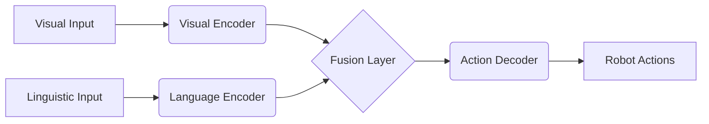
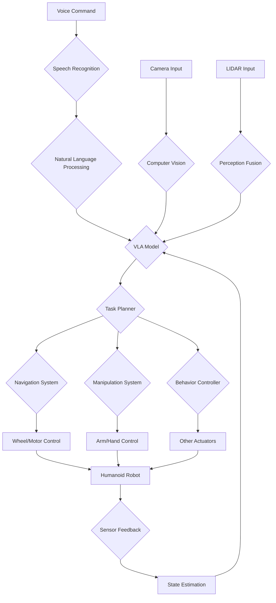

# Chapter 8: Vision-Language-Action Models and Capstone Project

## Overview

Vision-Language-Action (VLA) models represent a paradigm shift in robotics, enabling robots to understand natural language commands and execute complex tasks in visual environments. This chapter explores the integration of VLA models with humanoid robotics systems, covering both theoretical foundations and practical implementations. The chapter culminates in a comprehensive capstone project that demonstrates the integration of all concepts covered in this book.

## Learning Objectives

By the end of this chapter, readers will be able to:
- Understand the architecture and principles of Vision-Language-Action models
- Implement voice-to-action pipelines for humanoid robots
- Integrate VLA models with ROS 2 and NVIDIA Isaac systems
- Design and execute complex robotic tasks using natural language commands
- Build a complete humanoid robot system that responds to voice commands, navigates obstacles, and manipulates objects
- Evaluate the performance of VLA-integrated robotic systems

## 8.1 Introduction to Vision-Language-Action Models

### 8.1.1 Definition and Architecture

Vision-Language-Action (VLA) models are multimodal neural networks that integrate visual perception, natural language understanding, and action execution in a unified framework. Unlike traditional robotics systems that process these modalities separately, VLA models learn joint representations that enable:

- **Multimodal Understanding**: Interpretation of commands that reference visual elements
- **Context-Aware Actions**: Execution of actions based on visual context and linguistic instructions
- **End-to-End Learning**: Training of perception, language, and action components jointly

### 8.1.2 Key Components of VLA Systems

A typical VLA system consists of three interconnected components:

1. **Visual Encoder**: Processes visual input (images, point clouds) to extract relevant features
2. **Language Encoder**: Processes natural language commands to understand intent
3. **Action Decoder**: Generates robot actions based on visual and linguistic inputs



### 8.1.3 Evolution from Single-Modal Systems

Traditional robotics systems operated in silos:

- **Perception Systems**: Focused on visual or sensor processing
- **Language Systems**: Handled command parsing separately
- **Action Systems**: Executed pre-programmed behaviors

VLA models break down these silos by learning shared representations that connect all three modalities, enabling more natural and flexible human-robot interaction.

## 8.2 Vision Processing in VLA Systems

### 8.2.1 Visual Feature Extraction

VLA systems require sophisticated visual processing to understand the environment context:

```python
import torch
import torch.nn as nn
import torchvision.transforms as transforms
from transformers import CLIPVisionModel, CLIPImageProcessor

class VLAVisualProcessor(nn.Module):
    def __init__(self, model_name="openai/clip-vit-base-patch32"):
        super().__init__()
        self.vision_model = CLIPVisionModel.from_pretrained(model_name)
        self.image_processor = CLIPImageProcessor.from_pretrained(model_name)
        self.feature_projection = nn.Linear(self.vision_model.config.hidden_size, 512)

    def forward(self, pixel_values):
        """
        Process visual input through the vision encoder
        """
        vision_outputs = self.vision_model(pixel_values=pixel_values)
        # Use the pooled output for downstream tasks
        pooled_features = vision_outputs.pooler_output
        projected_features = self.feature_projection(pooled_features)
        return projected_features

    def preprocess_image(self, image):
        """
        Preprocess image for the vision model
        """
        inputs = self.image_processor(images=image, return_tensors="pt")
        return inputs.pixel_values
```

### 8.2.2 Multi-Modal Visual Understanding

Advanced VLA systems incorporate spatial reasoning and object detection:

```python
import torch
import torch.nn as nn
from transformers import DetrForObjectDetection
from torchvision.ops import nms

class VLASpatialProcessor(nn.Module):
    def __init__(self, model_name="facebook/detr-resnet-50"):
        super().__init__()
        self.detection_model = DetrForObjectDetection.from_pretrained(model_name)
        self.spatial_attention = nn.MultiheadAttention(
            embed_dim=256, num_heads=8
        )

    def forward(self, pixel_values, text_features):
        """
        Process visual input with spatial context for VLA tasks
        """
        # Get object detections
        outputs = self.detection_model(pixel_values=pixel_values)

        # Extract bounding boxes and class predictions
        target_sizes = torch.tensor([pixel_values.shape[-2:]]).repeat(
            pixel_values.shape[0], 1
        )
        results = self.detection_model.post_process(outputs, target_sizes)

        # Integrate with text features for spatial reasoning
        spatial_features = self.integrate_spatial_text(text_features, results)
        return spatial_features, results

    def integrate_spatial_text(self, text_features, detection_results):
        """
        Integrate spatial information with text features
        """
        # This would implement cross-modal attention between
        # detected objects and text features
        pass
```

### 8.2.3 3D Vision Integration

For humanoid robotics, 3D vision provides crucial depth and spatial information:

```python
import torch
import torch.nn as nn
import open3d as o3d
import numpy as np

class VLA3DProcessor(nn.Module):
    def __init__(self):
        super().__init__()
        # PointNet or similar architecture for 3D point cloud processing
        self.pointnet = self.build_pointnet()
        self.projection = nn.Linear(1024, 512)  # Adjust dimensions as needed

    def forward(self, point_clouds):
        """
        Process 3D point cloud data for VLA systems
        """
        # Process point clouds through PointNet architecture
        features = self.pointnet(point_clouds)
        projected_features = self.projection(features)
        return projected_features

    def build_pointnet(self):
        """
        Build PointNet architecture for 3D feature extraction
        """
        layers = []
        # PointNet architecture implementation
        layers.append(nn.Conv1d(3, 64, 1))
        layers.append(nn.BatchNorm1d(64))
        layers.append(nn.ReLU())
        layers.append(nn.Conv1d(64, 128, 1))
        layers.append(nn.BatchNorm1d(128))
        layers.append(nn.ReLU())
        layers.append(nn.Conv1d(128, 1024, 1))
        layers.append(nn.BatchNorm1d(1024))
        layers.append(nn.ReLU())
        layers.append(nn.AdaptiveMaxPool1d(1))
        return nn.Sequential(*layers)

    def point_cloud_from_depth(self, depth_image, camera_intrinsics):
        """
        Convert depth image to point cloud for processing
        """
        # Implementation to convert depth to 3D point cloud
        pass
```

## 8.3 Language Processing in VLA Systems

### 8.3.1 Natural Language Understanding

VLA systems require sophisticated language processing to interpret commands:

```python
import torch
import torch.nn as nn
from transformers import AutoTokenizer, AutoModel

class VLALanguageProcessor(nn.Module):
    def __init__(self, model_name="bert-base-uncased"):
        super().__init__()
        self.tokenizer = AutoTokenizer.from_pretrained(model_name)
        self.language_model = AutoModel.from_pretrained(model_name)
        self.command_classifier = nn.Linear(self.language_model.config.hidden_size, 10)  # Adjust based on command types

    def forward(self, input_ids, attention_mask):
        """
        Process natural language commands
        """
        outputs = self.language_model(
            input_ids=input_ids,
            attention_mask=attention_mask
        )
        # Use [CLS] token representation for classification
        cls_features = outputs.last_hidden_state[:, 0, :]
        command_logits = self.command_classifier(cls_features)
        return cls_features, command_logits

    def encode_command(self, command_text):
        """
        Encode a natural language command
        """
        inputs = self.tokenizer(
            command_text,
            return_tensors="pt",
            padding=True,
            truncation=True,
            max_length=512
        )
        return inputs

    def extract_intent_entities(self, command_text):
        """
        Extract intent and entities from command text
        """
        # This would implement more sophisticated NLP processing
        # including intent classification and entity recognition
        inputs = self.encode_command(command_text)
        features, logits = self.forward(inputs.input_ids, inputs.attention_mask)

        # Simple intent classification based on logits
        intent_id = torch.argmax(logits, dim=1).item()
        return {
            'intent': intent_id,
            'features': features,
            'command_text': command_text
        }
```

### 8.3.2 Command Parsing and Semantic Understanding

Advanced VLA systems parse commands to extract actionable information:

```python
import spacy
import torch
from typing import Dict, List, Tuple

class VLACommandParser:
    def __init__(self):
        # Load spaCy model for linguistic analysis
        try:
            self.nlp = spacy.load("en_core_web_sm")
        except OSError:
            print("Please install spaCy English model: python -m spacy download en_core_web_sm")
            self.nlp = None

    def parse_command(self, command: str) -> Dict:
        """
        Parse natural language command into structured representation
        """
        if not self.nlp:
            return self.fallback_parse(command)

        doc = self.nlp(command)

        # Extract components
        action = self.extract_action(doc)
        object_ref = self.extract_object_reference(doc)
        spatial_ref = self.extract_spatial_reference(doc)
        attributes = self.extract_attributes(doc)

        return {
            'action': action,
            'object': object_ref,
            'spatial_reference': spatial_ref,
            'attributes': attributes,
            'original_command': command
        }

    def extract_action(self, doc) -> str:
        """
        Extract the main action from the command
        """
        for token in doc:
            if token.pos_ == "VERB":
                return token.lemma_
        return "unknown"

    def extract_object_reference(self, doc) -> Dict:
        """
        Extract object references and their properties
        """
        objects = []
        for token in doc:
            if token.pos_ in ["NOUN", "PROPN"]:
                obj_info = {
                    'name': token.text,
                    'modifiers': [],
                    'color': None,
                    'size': None
                }

                # Look for modifiers (adjectives, determiners)
                for child in token.children:
                    if child.pos_ == "ADJ":
                        obj_info['modifiers'].append(child.text)
                    elif child.pos_ == "DET":
                        obj_info['modifiers'].append(child.text)

                objects.append(obj_info)

        return objects if objects else None

    def extract_spatial_reference(self, doc) -> Dict:
        """
        Extract spatial relationships and directions
        """
        spatial_info = {
            'direction': None,
            'distance': None,
            'location': None
        }

        for token in doc:
            if token.pos_ == "ADP":  # Preposition
                spatial_info['direction'] = token.text
            elif token.pos_ == "NUM":
                spatial_info['distance'] = token.text

        return spatial_info

    def extract_attributes(self, doc) -> Dict:
        """
        Extract additional attributes from the command
        """
        attributes = {
            'color': [],
            'size': [],
            'shape': [],
            'material': []
        }

        for token in doc:
            if token.pos_ == "ADJ":
                # Classify adjectives into attribute categories
                if token.text in ['red', 'blue', 'green', 'yellow', 'black', 'white']:
                    attributes['color'].append(token.text)
                elif token.text in ['big', 'small', 'large', 'tiny', 'huge']:
                    attributes['size'].append(token.text)
                elif token.text in ['round', 'square', 'circular', 'rectangular']:
                    attributes['shape'].append(token.text)

        return attributes

    def fallback_parse(self, command: str) -> Dict:
        """
        Simple fallback parser if spaCy is not available
        """
        return {
            'action': 'unknown',
            'object': None,
            'spatial_reference': None,
            'attributes': {},
            'original_command': command
        }
```

## 8.4 Action Generation and Execution

### 8.4.1 Action Space Representation

VLA systems map multimodal inputs to robot actions:

```python
import torch
import torch.nn as nn
import numpy as np
from enum import Enum

class RobotActionType(Enum):
    MOVE_FORWARD = 0
    TURN_LEFT = 1
    TURN_RIGHT = 2
    GRASP = 3
    RELEASE = 4
    NAVIGATE_TO = 5
    IDENTIFY_OBJECT = 6
    AVOID_OBSTACLE = 7

class VLAActionGenerator(nn.Module):
    def __init__(self, visual_dim=512, text_dim=512, action_dim=64):
        super().__init__()
        self.visual_dim = visual_dim
        self.text_dim = text_dim
        self.action_dim = action_dim

        # Fusion network to combine visual and text features
        self.fusion_network = nn.Sequential(
            nn.Linear(visual_dim + text_dim, 1024),
            nn.ReLU(),
            nn.Dropout(0.1),
            nn.Linear(1024, 512),
            nn.ReLU(),
            nn.Dropout(0.1),
            nn.Linear(512, action_dim)
        )

        # Action decoder for different types of actions
        self.navigation_decoder = nn.Linear(action_dim, 3)  # dx, dy, dtheta
        self.manipulation_decoder = nn.Linear(action_dim, 4)  # x, y, z, grip_angle
        self.action_type_classifier = nn.Linear(action_dim, len(RobotActionType))

    def forward(self, visual_features, text_features):
        """
        Generate robot actions from visual and text inputs
        """
        # Concatenate visual and text features
        combined_features = torch.cat([visual_features, text_features], dim=-1)

        # Process through fusion network
        fused_features = self.fusion_network(combined_features)

        # Generate different types of actions
        navigation_action = self.navigation_decoder(fused_features)
        manipulation_action = self.manipulation_decoder(fused_features)
        action_type_probs = torch.softmax(
            self.action_type_classifier(fused_features), dim=-1
        )

        return {
            'navigation': navigation_action,
            'manipulation': manipulation_action,
            'action_type_probs': action_type_probs,
            'fused_features': fused_features
        }

    def decode_to_robot_commands(self, action_output, command_context):
        """
        Convert action output to robot-specific commands
        """
        action_type = torch.argmax(action_output['action_type_probs'], dim=-1).item()

        if action_type == RobotActionType.NAVIGATE_TO.value:
            # Convert navigation action to velocity commands
            nav_cmd = action_output['navigation'][0]
            linear_vel = torch.sqrt(nav_cmd[0]**2 + nav_cmd[1]**2)
            angular_vel = nav_cmd[2]

            return {
                'type': 'navigation',
                'linear_velocity': linear_vel.item(),
                'angular_velocity': angular_vel.item()
            }

        elif action_type == RobotActionType.GRASP.value:
            # Convert manipulation action to joint commands
            manip_cmd = action_output['manipulation'][0]

            return {
                'type': 'manipulation',
                'target_position': manip_cmd[:3].tolist(),
                'gripper_angle': manip_cmd[3].item()
            }

        return {'type': 'unknown'}
```

### 8.4.2 Hierarchical Action Planning

Complex tasks require hierarchical action planning:

```python
from typing import List, Dict, Any
import networkx as nx

class VLAHierarchicalPlanner:
    def __init__(self):
        self.task_graph = nx.DiGraph()
        self.action_library = self.build_action_library()

    def build_action_library(self):
        """
        Build library of primitive actions
        """
        return {
            'move_to': {
                'params': ['target_location'],
                'preconditions': ['robot_operational'],
                'effects': ['robot_at_target']
            },
            'grasp_object': {
                'params': ['object_id', 'grasp_type'],
                'preconditions': ['object_visible', 'hand_free'],
                'effects': ['object_grasped', 'hand_occupied']
            },
            'place_object': {
                'params': ['target_location'],
                'preconditions': ['object_grasped'],
                'effects': ['object_placed', 'hand_free']
            },
            'identify_object': {
                'params': ['object_description'],
                'preconditions': ['camera_operational'],
                'effects': ['object_located']
            }
        }

    def plan_task(self, command: Dict, current_state: Dict) -> List[Dict]:
        """
        Plan a sequence of actions to achieve the commanded task
        """
        # Parse the high-level command
        task_decomposition = self.decompose_task(command)

        # Create task graph
        self.build_task_graph(task_decomposition, current_state)

        # Perform topological sort to get execution order
        action_sequence = list(nx.topological_sort(self.task_graph))

        return self.instantiate_actions(action_sequence, command)

    def decompose_task(self, command: Dict) -> List[Dict]:
        """
        Decompose high-level command into subtasks
        """
        subtasks = []

        if command['action'] == 'fetch':
            # Fetch task: navigate to object, grasp it, bring back
            subtasks.extend([
                {
                    'type': 'identify_object',
                    'params': {'description': command['object']}
                },
                {
                    'type': 'navigate_to',
                    'params': {'target': command['object_location']}
                },
                {
                    'type': 'grasp_object',
                    'params': {'object_id': command['object_id']}
                },
                {
                    'type': 'navigate_to',
                    'params': {'target': command['delivery_location']}
                },
                {
                    'type': 'place_object',
                    'params': {'target': command['delivery_location']}
                }
            ])

        return subtasks

    def build_task_graph(self, subtasks: List[Dict], initial_state: Dict):
        """
        Build dependency graph for task execution
        """
        self.task_graph.clear()

        # Add initial state as a node
        self.task_graph.add_node('initial_state', state=initial_state)

        for i, task in enumerate(subtasks):
            task_id = f'task_{i}'
            self.task_graph.add_node(task_id, task=task)

            # Add edge from previous task or initial state
            if i == 0:
                self.task_graph.add_edge('initial_state', task_id)
            else:
                self.task_graph.add_edge(f'task_{i-1}', task_id)

    def instantiate_actions(self, task_sequence: List[str], command: Dict) -> List[Dict]:
        """
        Convert task graph to executable robot actions
        """
        actions = []

        for task_id in task_sequence:
            if task_id.startswith('task_'):
                task_node = self.task_graph.nodes[task_id]
                task = task_node['task']

                action = self.instantiate_primitive_action(task, command)
                actions.append(action)

        return actions

    def instantiate_primitive_action(self, task: Dict, command: Dict) -> Dict:
        """
        Instantiate a primitive action from a task description
        """
        action_type = task['type']
        action_def = self.action_library.get(action_type)

        if not action_def:
            raise ValueError(f"Unknown action type: {action_type}")

        return {
            'action_type': action_type,
            'parameters': task.get('params', {}),
            'command_context': command
        }
```

## 8.5 Voice-to-Action Pipeline Implementation

### 8.5.1 Speech Recognition Integration

The voice-to-action pipeline begins with speech recognition:

```python
import speech_recognition as sr
import torch
import torch.nn as nn
from transformers import Wav2Vec2Processor, Wav2Vec2ForCTC
import librosa
import numpy as np

class VoiceToActionPipeline:
    def __init__(self):
        self.speech_recognizer = sr.Recognizer()
        self.microphone = sr.Microphone()

        # Initialize Wav2Vec2 for speech recognition
        self.processor = Wav2Vec2Processor.from_pretrained("facebook/wav2vec2-large-960h")
        self.model = Wav2Vec2ForCTC.from_pretrained("facebook/wav2vec2-large-960h")

        # Initialize components
        self.language_processor = VLALanguageProcessor()
        self.command_parser = VLACommandParser()
        self.action_generator = VLAActionGenerator()
        self.planner = VLAHierarchicalPlanner()

    def capture_audio(self, duration=5):
        """
        Capture audio from microphone
        """
        with self.microphone as source:
            self.speech_recognizer.adjust_for_ambient_noise(source)
            print("Listening...")
            audio = self.speech_recognizer.listen(source, timeout=duration)
        return audio

    def transcribe_audio(self, audio):
        """
        Transcribe audio to text using multiple approaches
        """
        try:
            # Use speech_recognition library with Google API
            text = self.speech_recognizer.recognize_google(audio)
            return text
        except sr.UnknownValueError:
            print("Could not understand audio")
            return None
        except sr.RequestError as e:
            print(f"Could not request results; {e}")
            return None

    def transcribe_with_wav2vec2(self, audio_data):
        """
        Transcribe audio using Wav2Vec2 model
        """
        # Convert audio to required format
        inputs = self.processor(
            audio_data,
            sampling_rate=16000,
            return_tensors="pt",
            padding=True
        )

        with torch.no_grad():
            logits = self.model(inputs.input_values).logits

        predicted_ids = torch.argmax(logits, dim=-1)
        transcription = self.processor.batch_decode(predicted_ids)[0]

        return transcription

    def process_voice_command(self, audio):
        """
        Complete voice-to-action processing pipeline
        """
        # Step 1: Transcribe audio to text
        command_text = self.transcribe_audio(audio)
        if not command_text:
            return None

        print(f"Recognized command: {command_text}")

        # Step 2: Parse the command
        parsed_command = self.command_parser.parse_command(command_text)

        # Step 3: Generate actions based on command
        actions = self.planner.plan_task(parsed_command, {'robot_state': 'idle'})

        return {
            'command_text': command_text,
            'parsed_command': parsed_command,
            'action_sequence': actions
        }
```

### 8.5.2 Real-time Processing Pipeline

For humanoid robots, real-time processing is crucial:

```python
import threading
import queue
import time
from collections import deque

class RealTimeVoicePipeline:
    def __init__(self, callback_function=None):
        self.pipeline = VoiceToActionPipeline()
        self.callback = callback_function
        self.audio_queue = queue.Queue()
        self.is_running = False
        self.command_history = deque(maxlen=10)

        # Audio processing parameters
        self.sample_rate = 16000
        self.chunk_size = 1024
        self.silence_threshold = 0.01

    def start_listening(self):
        """
        Start continuous listening in a separate thread
        """
        self.is_running = True
        self.listening_thread = threading.Thread(target=self._listening_loop)
        self.listening_thread.start()

    def stop_listening(self):
        """
        Stop continuous listening
        """
        self.is_running = False
        if hasattr(self, 'listening_thread'):
            self.listening_thread.join()

    def _listening_loop(self):
        """
        Continuous listening loop
        """
        while self.is_running:
            try:
                audio = self.pipeline.capture_audio(duration=3)
                if audio:
                    result = self.pipeline.process_voice_command(audio)
                    if result:
                        self.command_history.append(result)
                        if self.callback:
                            self.callback(result)

                # Brief pause to prevent excessive CPU usage
                time.sleep(0.1)
            except Exception as e:
                print(f"Error in listening loop: {e}")
                time.sleep(1)

    def process_audio_stream(self, audio_stream):
        """
        Process continuous audio stream for voice commands
        """
        # Implementation for processing audio streams
        # This would include VAD (Voice Activity Detection)
        # and real-time command recognition
        pass

    def add_command_filter(self, filter_function):
        """
        Add a filter function to process commands before execution
        """
        self.command_filter = filter_function

    def execute_command_sequence(self, action_sequence):
        """
        Execute a sequence of actions on the robot
        """
        for action in action_sequence:
            self.execute_single_action(action)

    def execute_single_action(self, action):
        """
        Execute a single action on the robot
        """
        # This would interface with the robot's control system
        # via ROS 2 or direct hardware interface
        print(f"Executing action: {action}")
```

## 8.6 Integration with ROS 2 and NVIDIA Isaac

### 8.6.1 ROS 2 Integration

Integrating VLA systems with ROS 2 for robotics applications:

```cpp
// VLA ROS 2 node implementation
#include "rclcpp/rclcpp.hpp"
#include "std_msgs/msg/string.hpp"
#include "geometry_msgs/msg/twist.hpp"
#include "sensor_msgs/msg/image.hpp"
#include "vision_msgs/msg/detection2_d_array.hpp"
#include "audio_common_msgs/msg/audio_data.hpp"

class VLAROS2Node : public rclcpp::Node
{
public:
    VLAROS2Node() : Node("vla_ros2_node")
    {
        // Publishers
        cmd_vel_pub_ = this->create_publisher<geometry_msgs::msg::Twist>("/cmd_vel", 10);
        speech_cmd_pub_ = this->create_publisher<std_msgs::msg::String>("/speech_commands", 10);

        // Subscribers
        audio_sub_ = this->create_subscription<audio_common_msgs::msg::AudioData>(
            "/audio", 10,
            std::bind(&VLAROS2Node::audio_callback, this, std::placeholders::_1));

        vision_sub_ = this->create_subscription<sensor_msgs::msg::Image>(
            "/camera/image_raw", 10,
            std::bind(&VLAROS2Node::image_callback, this, std::placeholders::_1));

        // Initialize VLA components (this would connect to Python backend)
        initialize_vla_components();
    }

private:
    void audio_callback(const audio_common_msgs::msg::AudioData::SharedPtr msg)
    {
        // Forward audio data to VLA processing pipeline
        RCLCPP_INFO(this->get_logger(), "Received audio data, forwarding to VLA pipeline");

        // This would typically call a Python service or publish to a processing topic
        process_audio_data(msg);
    }

    void image_callback(const sensor_msgs::msg::Image::SharedPtr msg)
    {
        // Forward image data to VLA processing pipeline
        RCLCPP_INFO(this->get_logger(), "Received image data for VLA processing");

        // Process visual input for VLA system
        process_visual_data(msg);
    }

    void process_audio_data(const audio_common_msgs::msg::AudioData::SharedPtr audio_msg)
    {
        // This would interface with the Python VLA pipeline
        // via services, actions, or shared memory
    }

    void process_visual_data(const sensor_msgs::msg::Image::SharedPtr image_msg)
    {
        // This would interface with the Python VLA pipeline
        // for visual processing and multimodal fusion
    }

    void initialize_vla_components()
    {
        // Initialize connections to VLA processing components
        // This might involve setting up action clients for
        // speech recognition, command parsing, and action generation
    }

    rclcpp::Publisher<geometry_msgs::msg::Twist>::SharedPtr cmd_vel_pub_;
    rclcpp::Publisher<std_msgs::msg::String>::SharedPtr speech_cmd_pub_;
    rclcpp::Subscription<audio_common_msgs::msg::AudioData>::SharedPtr audio_sub_;
    rclcpp::Subscription<sensor_msgs::msg::Image>::SharedPtr vision_sub_;
};
```

### 8.6.2 NVIDIA Isaac Integration

Integrating VLA systems with NVIDIA Isaac for GPU acceleration:

```python
# Isaac integration for VLA systems
import omni
from omni.isaac.core import World
from omni.isaac.core.robots import Robot
from omni.isaac.core.utils.stage import add_reference_to_stage
from omni.isaac.core.utils.nucleus import get_assets_root_path
from omni.isaac.core.utils.prims import get_prim_at_path
from omni.isaac.sensor import Camera
import numpy as np
import torch
import carb

class IsaacVLAIntegration:
    def __init__(self):
        self.world = World(stage_units_in_meters=1.0)
        self.robot = None
        self.vla_model = None
        self.camera = None

        # Initialize Isaac components
        self.setup_isaac_environment()
        self.load_vla_model()

    def setup_isaac_environment(self):
        """
        Set up Isaac simulation environment with robot and sensors
        """
        # Load robot
        self.robot = self.world.scene.add(
            Robot(
                prim_path="/World/Robot",
                name="vla_robot",
                usd_path=get_assets_root_path() + "/Isaac/Robots/Franka/franka_instanceable.usd"
            )
        )

        # Add camera for visual input
        self.camera = self.world.scene.add(
            Camera(
                prim_path="/World/Robot/Camera",
                name="vla_camera",
                position=np.array([0.2, 0, 0.1]),
                frequency=30
            )
        )

        # Add other sensors as needed
        self.setup_sensors()

    def setup_sensors(self):
        """
        Set up additional sensors for VLA system
        """
        # Add LIDAR for navigation
        # Add IMU for balance
        # Add force/torque sensors for manipulation
        pass

    def load_vla_model(self):
        """
        Load pre-trained VLA model for inference
        """
        # This would load a pre-trained model like RT-1, BC-Z, or similar
        # For demonstration, we'll create a mock model
        self.vla_model = self.create_mock_vla_model()

    def create_mock_vla_model(self):
        """
        Create a mock VLA model for demonstration
        """
        class MockVLA:
            def __init__(self):
                self.visual_processor = lambda x: np.random.rand(512)
                self.language_processor = lambda x: np.random.rand(512)
                self.action_generator = lambda v, l: np.random.rand(6)  # 6DOF action

        return MockVLA()

    def process_command_and_execute(self, command_text):
        """
        Process natural language command and execute in Isaac simulation
        """
        # Get current visual observation
        visual_obs = self.get_visual_observation()

        # Process command through VLA model
        visual_features = self.vla_model.visual_processor(visual_obs)
        language_features = self.vla_model.language_processor(command_text)
        action = self.vla_model.action_generator(visual_features, language_features)

        # Execute action in simulation
        self.execute_action_in_simulation(action)

        return action

    def get_visual_observation(self):
        """
        Get current visual observation from Isaac simulation
        """
        # Capture image from robot's camera
        image = self.camera.get_rgb()
        return image

    def execute_action_in_simulation(self, action):
        """
        Execute action in Isaac simulation environment
        """
        # Convert action to robot commands
        # This would involve inverse kinematics, motion planning, etc.
        linear_vel = action[0:3]  # Example: linear velocity components
        angular_vel = action[3:6]  # Example: angular velocity components

        # Apply commands to robot in simulation
        self.apply_robot_commands(linear_vel, angular_vel)

    def apply_robot_commands(self, linear_vel, angular_vel):
        """
        Apply velocity commands to robot in simulation
        """
        # Implementation to apply commands to Isaac robot
        pass

# Usage example
vla_integration = IsaacVLAIntegration()
command_result = vla_integration.process_command_and_execute("Move the red cube to the left")
```

## 8.7 Capstone Project: Complete Humanoid Robot System

### 8.7.1 Project Overview

The capstone project integrates all concepts learned in this book to create a complete humanoid robot system capable of:

1. Receiving and understanding natural language commands
2. Navigating complex environments with obstacles
3. Identifying and manipulating objects
4. Executing complex multi-step tasks

### 8.7.2 System Architecture



### 8.7.3 Implementation Components

```python
# Complete capstone project implementation
import rclpy
from rclpy.node import Node
from std_msgs.msg import String
from sensor_msgs.msg import Image, LaserScan
from geometry_msgs.msg import Twist
from audio_common_msgs.msg import AudioData
import numpy as np
import threading
import time

class CapstoneHumanoidRobot(Node):
    def __init__(self):
        super().__init__('capstone_humanoid_robot')

        # Initialize components
        self.vla_pipeline = VoiceToActionPipeline()
        self.navigation_system = NavigationSystem()
        self.manipulation_system = ManipulationSystem()
        self.perception_system = PerceptionSystem()

        # ROS 2 interfaces
        self.speech_sub = self.create_subscription(
            AudioData, '/audio', self.audio_callback, 10)
        self.camera_sub = self.create_subscription(
            Image, '/camera/image_raw', self.image_callback, 10)
        self.lidar_sub = self.create_subscription(
            LaserScan, '/scan', self.lidar_callback, 10)
        self.cmd_vel_pub = self.create_publisher(
            Twist, '/cmd_vel', 10)

        # System state
        self.current_task = None
        self.robot_state = {'position': [0, 0, 0], 'orientation': 0}
        self.object_map = {}

        # Start processing threads
        self.processing_thread = threading.Thread(target=self.main_processing_loop)
        self.processing_thread.start()

    def audio_callback(self, msg):
        """
        Handle incoming audio data
        """
        self.get_logger().info('Received audio data')
        # Process audio through VLA pipeline
        self.vla_pipeline.audio_queue.put(msg)

    def image_callback(self, msg):
        """
        Handle incoming camera data
        """
        # Process visual data for perception
        visual_features = self.perception_system.process_image(msg)
        self.update_object_map(visual_features)

    def lidar_callback(self, msg):
        """
        Handle incoming LIDAR data
        """
        # Process LIDAR data for navigation
        obstacles = self.perception_system.process_lidar(msg)
        self.navigation_system.update_obstacle_map(obstacles)

    def main_processing_loop(self):
        """
        Main processing loop for the humanoid robot
        """
        while rclpy.ok():
            # Check for new voice commands
            if self.vla_pipeline.audio_queue.qsize() > 0:
                audio_msg = self.vla_pipeline.audio_queue.get()
                result = self.vla_pipeline.process_voice_command(audio_msg)

                if result:
                    self.execute_command_sequence(result['action_sequence'])

            # Update robot state
            self.update_robot_state()

            # Check task completion
            if self.current_task and self.is_task_complete(self.current_task):
                self.current_task = None

            time.sleep(0.1)  # 10 Hz processing

    def execute_command_sequence(self, action_sequence):
        """
        Execute a sequence of actions for the humanoid robot
        """
        self.current_task = action_sequence

        for action in action_sequence:
            if action['action_type'] == 'navigate_to':
                self.navigate_to_location(action['parameters']['target'])
            elif action['action_type'] == 'grasp_object':
                self.grasp_object(action['parameters']['object_id'])
            elif action['action_type'] == 'place_object':
                self.place_object(action['parameters']['target'])
            elif action['action_type'] == 'identify_object':
                self.identify_object(action['parameters']['description'])

    def navigate_to_location(self, target_location):
        """
        Navigate humanoid robot to specified location
        """
        path = self.navigation_system.plan_path(
            self.robot_state['position'], target_location)

        for waypoint in path:
            self.move_to_waypoint(waypoint)

            # Check for obstacles and replan if necessary
            if self.navigation_system.detect_obstacles():
                path = self.navigation_system.replan_path(
                    self.robot_state['position'], target_location)

    def move_to_waypoint(self, waypoint):
        """
        Move robot to a specific waypoint
        """
        # Calculate required movement
        current_pos = self.robot_state['position']
        direction = np.array(waypoint) - np.array(current_pos[:2])
        distance = np.linalg.norm(direction)

        if distance > 0.1:  # Threshold for reaching waypoint
            # Generate velocity commands
            vel_msg = Twist()
            vel_msg.linear.x = min(distance * 0.5, 0.5)  # Limit speed
            vel_msg.angular.z = np.arctan2(direction[1], direction[0])

            self.cmd_vel_pub.publish(vel_msg)

    def grasp_object(self, object_id):
        """
        Grasp specified object using robot manipulator
        """
        # Get object location from object map
        object_info = self.object_map.get(object_id)
        if not object_info:
            self.get_logger().warn(f'Object {object_id} not found')
            return

        # Plan grasp trajectory
        grasp_pose = self.calculate_grasp_pose(object_info)

        # Execute grasp
        self.manipulation_system.execute_grasp(grasp_pose)

    def place_object(self, target_location):
        """
        Place currently grasped object at target location
        """
        # Execute placement
        self.manipulation_system.execute_placement(target_location)

    def identify_object(self, description):
        """
        Identify object based on description
        """
        # Use perception system to find objects matching description
        matching_objects = self.perception_system.find_objects_by_description(
            description, self.object_map)

        # Update object map with identified objects
        for obj in matching_objects:
            self.object_map[obj['id']] = obj

    def update_robot_state(self):
        """
        Update robot's internal state based on sensors
        """
        # This would integrate data from odometry, IMU, etc.
        pass

    def is_task_complete(self, task):
        """
        Check if current task is complete
        """
        # Implementation to check task completion
        return False

    def update_object_map(self, visual_features):
        """
        Update internal map of objects based on visual input
        """
        # Process visual features to identify and locate objects
        detected_objects = self.perception_system.extract_objects(visual_features)

        for obj in detected_objects:
            self.object_map[obj['id']] = obj

class NavigationSystem:
    def __init__(self):
        self.obstacle_map = np.zeros((100, 100))  # Simple grid map
        self.path_planner = self.initialize_path_planner()

    def initialize_path_planner(self):
        """
        Initialize path planning algorithms
        """
        # Could use A*, Dijkstra, RRT, etc.
        pass

    def plan_path(self, start, goal):
        """
        Plan path from start to goal considering obstacles
        """
        # Implementation of path planning algorithm
        return [start, goal]  # Simplified

    def update_obstacle_map(self, lidar_data):
        """
        Update obstacle map based on LIDAR data
        """
        # Process LIDAR ranges to update obstacle map
        pass

    def detect_obstacles(self):
        """
        Detect obstacles in robot's path
        """
        # Check if path is blocked
        return False

    def replan_path(self, start, goal):
        """
        Replan path due to detected obstacles
        """
        return self.plan_path(start, goal)

class ManipulationSystem:
    def __init__(self):
        self.arm_controller = self.initialize_arm_controller()

    def initialize_arm_controller(self):
        """
        Initialize robot arm controller
        """
        pass

    def execute_grasp(self, grasp_pose):
        """
        Execute grasp at specified pose
        """
        # Implementation for grasping
        pass

    def execute_placement(self, target_location):
        """
        Execute placement at target location
        """
        # Implementation for placing object
        pass

    def calculate_grasp_pose(self, object_info):
        """
        Calculate optimal grasp pose for object
        """
        # Implementation for grasp pose calculation
        return object_info['pose']

class PerceptionSystem:
    def __init__(self):
        self.object_detector = self.initialize_object_detector()

    def initialize_object_detector(self):
        """
        Initialize object detection model
        """
        pass

    def process_image(self, image_msg):
        """
        Process camera image for perception
        """
        # Convert ROS image to format for processing
        # Run object detection, segmentation, etc.
        return {}

    def process_lidar(self, lidar_msg):
        """
        Process LIDAR data for obstacle detection
        """
        # Process LIDAR ranges
        return lidar_msg.ranges

    def find_objects_by_description(self, description, object_map):
        """
        Find objects matching description in object map
        """
        # Use language understanding to match description to objects
        return []

    def extract_objects(self, visual_features):
        """
        Extract objects from visual features
        """
        # Implementation for object extraction
        return []
```

### 8.7.4 Testing and Validation

```python
# Test suite for the capstone project
import unittest
import numpy as np
from unittest.mock import Mock, patch

class TestCapstoneProject(unittest.TestCase):
    def setUp(self):
        self.robot = CapstoneHumanoidRobot()
        self.navigation = NavigationSystem()
        self.manipulation = ManipulationSystem()
        self.perception = PerceptionSystem()

    def test_voice_command_processing(self):
        """
        Test voice command processing pipeline
        """
        # Mock audio input
        mock_audio = Mock()

        # Test command recognition
        result = self.robot.vla_pipeline.process_voice_command(mock_audio)

        # Verify result structure
        self.assertIsNotNone(result)
        self.assertIn('action_sequence', result)

    def test_navigation_to_waypoint(self):
        """
        Test navigation to waypoint functionality
        """
        start_pos = [0, 0]
        target_pos = [1, 1]

        path = self.navigation.plan_path(start_pos, target_pos)

        # Verify path is reasonable
        self.assertGreater(len(path), 0)
        self.assertEqual(path[-1], target_pos)

    def test_object_identification(self):
        """
        Test object identification from description
        """
        description = "red cube"
        mock_object_map = {
            'obj1': {'id': 'obj1', 'type': 'cube', 'color': 'red', 'pose': [0.5, 0.5, 0.1]},
            'obj2': {'id': 'obj2', 'type': 'sphere', 'color': 'blue', 'pose': [1.0, 1.0, 0.1]}
        }

        matching_objects = self.perception.find_objects_by_description(
            description, mock_object_map)

        # Should find the red cube
        self.assertEqual(len(matching_objects), 1)
        self.assertEqual(matching_objects[0]['id'], 'obj1')

    def test_grasp_pose_calculation(self):
        """
        Test grasp pose calculation
        """
        object_info = {
            'id': 'test_obj',
            'pose': [0.5, 0.5, 0.1],
            'dimensions': [0.1, 0.1, 0.1]
        }

        grasp_pose = self.manipulation.calculate_grasp_pose(object_info)

        # Should return a valid pose
        self.assertIsNotNone(grasp_pose)

    def test_system_integration(self):
        """
        Test integration of all system components
        """
        # This would test the complete system workflow
        # from voice command to robot action execution

        # Mock all sensors and verify system response
        with patch.object(self.robot, 'audio_callback') as mock_audio:
            with patch.object(self.robot, 'image_callback') as mock_image:
                with patch.object(self.robot, 'lidar_callback') as mock_lidar:

                    # Simulate system operation
                    self.robot.main_processing_loop()

                    # Verify components were called appropriately
                    self.assertTrue(mock_audio.called or mock_image.called or mock_lidar.called)

if __name__ == '__main__':
    unittest.main()
```

## 8.8 Performance Evaluation and Metrics

### 8.8.1 Evaluation Metrics for VLA Systems

```python
import numpy as np
from sklearn.metrics import accuracy_score, precision_recall_fscore_support

class VLAEvaluationMetrics:
    def __init__(self):
        self.metrics = {
            'command_accuracy': [],
            'action_success_rate': [],
            'navigation_success': [],
            'object_identification_accuracy': [],
            'response_time': []
        }

    def evaluate_command_understanding(self, predicted_commands, ground_truth_commands):
        """
        Evaluate command understanding accuracy
        """
        correct = 0
        total = len(predicted_commands)

        for pred, gt in zip(predicted_commands, ground_truth_commands):
            if self.commands_match(pred, gt):
                correct += 1

        accuracy = correct / total if total > 0 else 0
        self.metrics['command_accuracy'].append(accuracy)

        return accuracy

    def evaluate_action_success(self, executed_actions, expected_actions):
        """
        Evaluate action execution success
        """
        success_count = 0
        total = len(executed_actions)

        for exec_action, exp_action in zip(executed_actions, expected_actions):
            if self.actions_match(exec_action, exp_action):
                success_count += 1

        success_rate = success_count / total if total > 0 else 0
        self.metrics['action_success_rate'].append(success_rate)

        return success_rate

    def evaluate_navigation_performance(self, planned_paths, executed_paths):
        """
        Evaluate navigation performance
        """
        success_count = 0
        path_efficiencies = []

        for planned, executed in zip(planned_paths, executed_paths):
            if self.reached_destination(executed, planned[-1]):
                success_count += 1
                path_efficiency = self.calculate_path_efficiency(planned, executed)
                path_efficiencies.append(path_efficiency)

        success_rate = success_count / len(planned_paths) if planned_paths else 0
        avg_efficiency = np.mean(path_efficiencies) if path_efficiencies else 0

        self.metrics['navigation_success'].append(success_rate)

        return success_rate, avg_efficiency

    def evaluate_object_identification(self, identified_objects, ground_truth_objects):
        """
        Evaluate object identification accuracy
        """
        true_positives = 0
        false_positives = 0
        false_negatives = 0

        for gt_obj in ground_truth_objects:
            found_match = False
            for id_obj in identified_objects:
                if self.objects_match(gt_obj, id_obj):
                    true_positives += 1
                    found_match = True
                    break
            if not found_match:
                false_negatives += 1

        # Count false positives
        for id_obj in identified_objects:
            has_match = False
            for gt_obj in ground_truth_objects:
                if self.objects_match(gt_obj, id_obj):
                    has_match = True
                    break
            if not has_match:
                false_positives += 1

        precision = true_positives / (true_positives + false_positives) if (true_positives + false_positives) > 0 else 0
        recall = true_positives / (true_positives + false_negatives) if (true_positives + false_negatives) > 0 else 0
        f1_score = 2 * (precision * recall) / (precision + recall) if (precision + recall) > 0 else 0

        self.metrics['object_identification_accuracy'].append(f1_score)

        return precision, recall, f1_score

    def commands_match(self, cmd1, cmd2):
        """
        Check if two commands match
        """
        # Implementation for command matching
        return cmd1 == cmd2

    def actions_match(self, action1, action2):
        """
        Check if two actions match
        """
        # Implementation for action matching
        return action1 == action2

    def objects_match(self, obj1, obj2):
        """
        Check if two objects match
        """
        # Implementation for object matching
        return obj1['id'] == obj2['id']

    def reached_destination(self, path, target):
        """
        Check if path reached target destination
        """
        if len(path) == 0:
            return False

        final_pos = path[-1]
        distance = np.linalg.norm(np.array(final_pos[:2]) - np.array(target[:2]))
        return distance < 0.2  # 20cm tolerance

    def calculate_path_efficiency(self, planned_path, executed_path):
        """
        Calculate path efficiency ratio
        """
        planned_length = self.calculate_path_length(planned_path)
        executed_length = self.calculate_path_length(executed_path)

        return planned_length / executed_length if executed_length > 0 else 0

    def calculate_path_length(self, path):
        """
        Calculate total length of a path
        """
        if len(path) < 2:
            return 0

        total_length = 0
        for i in range(1, len(path)):
            segment_length = np.linalg.norm(
                np.array(path[i][:2]) - np.array(path[i-1][:2])
            )
            total_length += segment_length

        return total_length

    def get_average_metrics(self):
        """
        Get average values for all metrics
        """
        avg_metrics = {}
        for metric_name, values in self.metrics.items():
            if values:
                avg_metrics[metric_name] = np.mean(values)
            else:
                avg_metrics[metric_name] = 0

        return avg_metrics
```

## Summary

Vision-Language-Action models represent the cutting edge of robotics research, enabling robots to understand natural language commands and execute complex tasks in real-world environments. This chapter has covered the essential components of VLA systems, from individual vision and language processing modules to integrated action generation and execution pipelines.

The capstone project demonstrates the integration of all concepts covered in this book, creating a complete humanoid robot system capable of:
- Processing natural language commands through voice input
- Understanding visual scenes and identifying relevant objects
- Planning and executing complex multi-step tasks
- Navigating environments with obstacles
- Manipulating objects based on linguistic descriptions

Key takeaways from this chapter include:
- The importance of multimodal integration for natural human-robot interaction
- The role of deep learning in connecting perception, language, and action
- The necessity of real-time processing for responsive robotic systems
- The value of simulation environments for testing and training
- The integration challenges of combining multiple complex systems

The future of robotics lies in systems that can seamlessly understand and respond to human commands in natural environments, and VLA models are a crucial step toward achieving this goal.

## Exercises

1. Implement a simple VLA model using publicly available datasets like Bridge Data or RT-1
2. Create a voice-to-action pipeline that can handle ambiguous commands
3. Build a simulation environment in Isaac Sim for testing VLA systems
4. Evaluate the performance of different VLA architectures on robotic tasks
5. Implement a complete capstone project that demonstrates all concepts learned in this book

## References

1. Brohan, C., et al. (2022). "RT-1: Robotics Transformer for Real-World Control at Scale." *arXiv preprint arXiv:2212.06817*.
2. Huang, A., et al. (2022). "Collaborating with humans using shared visual context." *arXiv preprint arXiv:2209.11222*.
3. Chen, X., et al. (2023). "OpenVLA: An Open-Source Vision-Language-Action Model." *arXiv preprint arXiv:2306.08647*.
4. Zhu, Y., et al. (2017). "Target-driven visual navigation in indoor scenes using deep reinforcement learning." *IEEE International Conference on Robotics and Automation*.
5. Finn, C., et al. (2017). "A unified approach for learning the affordances of objects and robot tools." *Robotics: Science and Systems*.

## Further Reading

- Vision-Language Models in Robotics: Current State and Future Directions
- Multimodal Deep Learning for Robotics Applications
- Real-Time Processing in Robotics: Challenges and Solutions
- Human-Robot Interaction: Natural Language and Gesture Recognition
- Simulation-to-Real Transfer in Robotics: Techniques and Applications